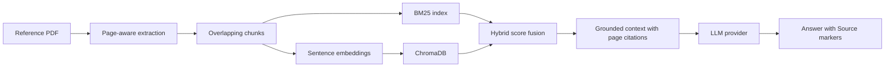

# Nuclear Law RAG Copilot

A source-grounded Streamlit assistant for exploring nuclear-law reference PDFs. The application uses page-aware ingestion, hybrid BM25 + dense retrieval, ChromaDB persistence, and a provider-agnostic generation layer.

> **Status:** early portfolio prototype. It is designed for research and document navigation, not legal advice. Retrieval and answer-quality benchmarking are still in progress.

## What is implemented

- Page-aware PDF extraction so retrieved evidence retains a page number.
- Overlapping chunk construction with document hashes and stable identifiers.
- Hybrid ranking that combines BM25 lexical scores with normalized sentence-transformer similarity.
- Persistent ChromaDB storage with deterministic upserts.
- Grounded prompts that require `[Source N]` markers and prohibit invented dates, legal status, page numbers, or treaty obligations.
- OpenAI, Gemini, OpenRouter, and local Ollama provider adapters.
- Streamlit chat UI with source previews, PDF upload, theme switching, and knowledge-base refresh.
- Upload filename sanitization, public-HTTPS-only URL ingestion, local-network blocking, redirect rejection, timeouts, and a 25 MiB PDF limit.

## Pipeline



## Technology stack

| Area | Technologies |
|---|---|
| Application | Python, Streamlit |
| Retrieval | BM25, sentence transformers, ChromaDB |
| Documents | page-aware PDF extraction and validated upload/URL ingestion |
| Generation | OpenAI, Gemini, OpenRouter, or local Ollama |
| Verification | unittest and evidence-led documentation |

## Quick start

```bash
python -m venv .venv
# macOS/Linux
source .venv/bin/activate
# Windows PowerShell
.venv\Scripts\Activate.ps1

python -m pip install -r requirements.txt
# macOS/Linux
cp .env.example .env
# Windows PowerShell
Copy-Item .env.example .env

streamlit run streamlit_app.py
```

Add PDFs through the UI or place legally obtained copies in `documents/`. The two reference publications used during development are listed in [`documents/README.md`](documents/README.md); the PDFs are intentionally not redistributed in this repository.

## Configuration

Set one provider in `.env`:

```env
LLM_PROVIDER=openrouter
OPENROUTER_API_KEY=your_key
OPENROUTER_MODEL=openai/gpt-4o-mini
```

Ollama can be used locally without a hosted-provider API key. Never commit `.env`, Chroma data, or uploaded PDFs.

## Verification

Run the dependency-light checks:

```bash
python -m unittest discover -s tests -p "test_*.py"
```

See [`EVIDENCE.md`](EVIDENCE.md) for the exact boundary between implemented evidence and work that remains unvalidated.

## Known limitations

- No legal-currentness claim is inferred from a filename or upload date; source status defaults to `unknown`.
- Scanned PDFs require OCR before text extraction.
- Retrieval quality still needs a labeled question/answer benchmark with Recall@K or nDCG.
- Provider calls require their respective services, keys, and terms.
- The system can still surface incomplete context; users must verify the cited page in the original publication.

## Author

**Alaa Ahmed Elgendy** — [Portfolio](https://alaaelgendy22.github.io/Alaa-Elgendy) · [LinkedIn](https://www.linkedin.com/in/alaa-ahmed-elgendy)
